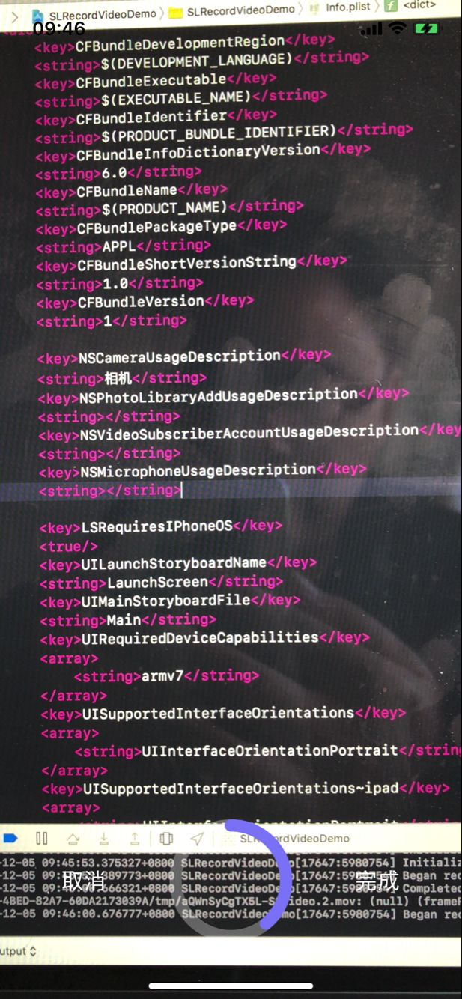

## 小视频拍摄



### 安装

pod 'SLRecordVideo'

### 使用

```object-c
SLRecordVideoViewController *controller = [[SLRecordVideoViewController alloc] init];
[controller setCompleteBlock:^(SCRecordSession *recordSession, NSString *filePath) {
// recordSession.outputUrl 沙盒缓存路径
// filePath 相册保存路径
}];
```

### 注意：info.plist中添加权限

```
<key>NSCameraUsageDescription</key>
<string>相机</string>
<key>NSPhotoLibraryAddUsageDescription</key>
<string></string>
<key>NSVideoSubscriberAccountUsageDescription</key>
<string></string>
<key>NSMicrophoneUsageDescription</key>
<string></string>
```


